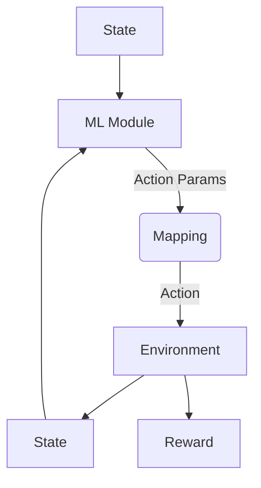

# RL_on_Param_Tuning

A sample flow chart:

1. State: 
    $X_t = (O_t, H_t, C_t, L_t, V_t)$, each one is with close price from day t-20 to day t.
    - Stating from all close price first, adding more later.
2. Action:
    - Feasible action: (1, 0, -1) for (buy, hold, sell). Each time buy/sell a prefixed amount N(subject to change).
    - But our $\pi_\theta$ is not a function to decide the action. Instead, that function is going to decide a parameter $\theta_{opt}$. We use another mapping function to decide the final action.
    - Or maybe, the mapping function should be another ML module.
3. Reward: 
    - Change of portfolio value (subject to change) 
4. The ML Module in this experiment is a LSTM. (From Kelly(...), LSTM works better for low-frequency)
5. Parameter(s) realted:
    - Continuous / discrete? May need some extra function for mapping / ...
6. Experiment Benchmark: Compare the parameter selection by RL with ... method? 